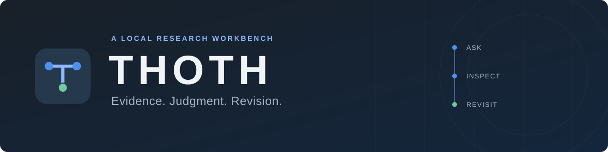

<p align="center">
  
</p>

<p align="center">
  <strong>근거를 따라, 판단의 변화를 남기다.</strong><br>
  Follow the evidence. Keep the history of your judgment.
</p>

<p align="center">
  <a href="LICENSE"></a>
  <a href="#현재-상태"></a>
  <a href="docs/INSTALL.md"></a>
</p>

<p align="center">
  <a href="#빠른-시작">시작하기</a> ·
  <a href="#무엇을-할-수-있나요">주요 기능</a> ·
  <a href="docs/VERIFICATION.md">검증 기록</a> ·
  <a href="CONTRIBUTING.md">기여하기</a><br>
  <a href="README.md">English</a> · <strong>한국어</strong>
</p>

---

자료가 바뀌고, 결과가 수정됩니다. 함께 일하는 사람은 그 이유를 알아야 합니다.

**THOTH는 연구 질문, 원문 근거, 경쟁 가설, 저장된 결과를 연결하는 로컬 AI 연구 워크벤치입니다.**
판단을 뒷받침하는 근거와 아직 풀리지 않은 문제를 살펴보고, 저장된 두 결과를 비교하며 다음 행동을 정합니다.

<p align="center">
  
  <br><sub>THOTH 브랜드 일러스트 — 기록의 신 토트를 연구 워크벤치의 이미지로 표현했습니다.</sub>
</p>

> [!NOTE]
> **개인·로컬 사용을 위한 실험적 소스 공개본입니다.** UI는 한국어 중심입니다.
> 집중 기능 검사와 설치 검증을 통과했으며, 저장소 회귀 테스트 25건은 미해결 상태입니다.
> 결과를 사용하기 전에 [현재 상태와 한계](#현재-상태)를 확인하세요.

## 무엇을 할 수 있나요

| 근거를 따라갑니다 | 판단을 검토합니다 | 변화를 남깁니다 |
| :--- | :--- | :--- |
| 문서를 연결하고 원문 위치, 자료 버전, 시점의 적격성을 살펴봅니다. | 답변과 함께 경쟁 가설, 부족한 근거, 다음 행동을 검토합니다. | 저장된 두 결과를 정확히 골라 비교합니다. 지원되는 복원은 기존 기록을 지우지 않고 새 버전으로 남깁니다. |

**이전 결과를 보존하면서 질문을 이어갑니다.** 작업이 실행 중이면 새 입력을 대기시킬 수 있으며, 재전송과 복구에서도 요청의 정체성을 유지합니다.

**미해결 상태를 드러냅니다.** 처리가 끝나도 답변은 부분적일 수 있고 판단은 보류될 수 있습니다. 처리 완료와 근거 충족을 구분합니다.

**사용할 연결을 직접 고릅니다.** 로컬 작업 공간에서 지원되는 로그인 또는 API 키를 설정하고 모델과 추론 수준을 선택합니다. 저장된 선택을 유지하며, 지원되지 않는 경로는 명시합니다. 저장된 결과나 비교를 읽는 것만으로 새 모델 호출이 시작되지는 않습니다.

## 다시 살펴볼 수 있는 연구 흐름

| 단계 | THOTH에서 하는 일 |
| :--- | :--- |
| **1 · 질문** | 연구 질문을 만들고 관련 문서를 연결합니다. |
| **2 · 검토** | 답변의 원문 근거를 확인하고 경쟁 가설과 부족한 정보를 살펴봅니다. |
| **3 · 이어가기** | 자료나 후속 질문을 추가합니다. 실행 중인 작업 뒤에 입력을 대기시킬 수 있습니다. |
| **4 · 비교** | 저장된 두 결과를 골라 무엇이 달라졌는지 확인하고, 필요하면 이력을 다시 살펴봅니다. |

## 빠른 시작

**Windows · 소스 체크아웃 · Python 3.12 또는 3.13 · [uv](https://docs.astral.sh/uv/) · Node.js · pnpm**

저장소를 내려받고 잠금 파일에 맞춰 의존성을 설치합니다.

```powershell
git clone https://github.com/hyperdrivebeep/thoth-public.git
cd thoth-public
uv sync --frozen --extra dev --dev
pnpm install --frozen-lockfile
```

첫 번째 터미널에서 API를 시작합니다.

```powershell
.\.venv\Scripts\thoth.exe serve --workspace .\.thoth-local --port 8765
```

두 번째 터미널에서 같은 저장소를 열고 웹 화면을 시작합니다.

```powershell
pnpm --dir apps/web run dev
```

**<http://127.0.0.1:5173/>**을 엽니다. 처음 설정 또는 설정 화면에서 지원되는 로그인 경로를 선택하거나 본인의 API 키를 입력한 뒤 모델을 고릅니다. 실제 호출에는 해당 서비스의 사용량이 소모될 수 있습니다.

API는 로컬 루프백 주소에 바인딩되고, Vite는 API 요청을 8765 포트로 전달합니다. 소스와 migration 디렉터리를 함께 사용해야 하며, 이 공개본은 독립 wheel 설치를 지원하지 않습니다.

<details>
<summary><strong>설치 환경과 선택적 연동</strong></summary>

격리된 Windows 검증에는 Python 3.13.15, Node 24.19.0, pnpm 12.6.0, uv 0.12.5를 사용했습니다.
기본 PDF 처리는 pypdf를 사용합니다. 구조화 PDF, 브라우저 수집, 추가 커넥터, 관리형 샌드박스는 별도 의존성과 실행 조건이 있습니다.

기본 연결은 OMO 인증 정보를 자동으로 가져오지 않습니다. 선택적인 공식 Codex 카탈로그는 CLI의 로컬 설정·캐시가 있으면 읽을 수 있습니다. 계정 설정은 저장소에 배포하지 않습니다.

자세한 내용은 [설치와 인증 안내](docs/INSTALL.md)를 확인하세요.

</details>

## 현재 상태

이 저장소는 **실험적 참조 구현**이며, 다음 검증 범위 안에서 상태를 설명합니다.

| 로컬에서 확인한 항목 | 검증 범위 |
| :--- | :--- |
| 입력 대기열, 입력 버전 검사, 정확한 두 결과 비교 | 선택한 통합 테스트 4건 통과. 변경되지 않은 비교 UI는 기존 Chrome 검증 기록을 유지합니다. |
| 새 환경의 frozen 설치, doctor, 웹 build | 기록된 Windows 환경에서 통과했습니다. |
| 합성 근거 데이터 UI | 집중 웹 테스트 36건을 통과했습니다. |
| 첫 실행 Chrome/API 확인 | 인증 정보나 모델 호출 없이 통과했습니다. 모델 미연결은 예상된 초기 상태입니다. |

**저장소 회귀 테스트 25건은 미해결입니다.** 집중 기능 검사와 별개이며, 현재 소스 전체 회귀가 통과했다고 주장하지 않습니다. 재배포 권리를 확인하지 못한 일부 과거 예제 자료도 공개본에서 제외했습니다.

이 검증으로 실제 모델의 답변 품질, 여러 runtime을 사용하는 Hosted 운영 준비, 폭넓은 플랫폼 호환성, 실제 협업자의 시간 절감 효과가 입증된 것은 아닙니다.

[검증 기록](docs/VERIFICATION.md) · [미해결 테스트 목록](docs/KNOWN_TEST_FAILURES.json) · [공개 파일 범위](docs/PACKAGING.md)

## 내부를 살펴보기

| 영역 | 위치 |
| :--- | :--- |
| Python 백엔드 | [`src/thoth`](src/thoth) — domain → ports → application → adapters, 조립은 `apps`. |
| React / TypeScript UI | [`apps/web`](apps/web) |
| 정본 데이터와 변경 이력 | SQLite, 버전별 migration은 [`migrations`](migrations). |
| 로고·일러스트·색상·소개 문구 | [`docs/brand`](docs/brand) |

화면의 요약은 정본 데이터나 권한 검사를 대신하지 않습니다. 재현에는 합성 자료와 격리된 작업 공간을 사용하며, 자료 시점·범위·현재성·권한 검사를 유지합니다. 변경을 제안하기 전에 [기여 안내](CONTRIBUTING.md)를 읽어주세요.

## 라이선스

이 공개본의 자체 코드, 문서, THOTH 브랜드 자산, 자체 합성 fixture는 **[MIT License](LICENSE)**로 제공합니다. Copyright 2026 THOTH.
의존성에는 각자의 라이선스가 적용됩니다. [외부 의존성·자산 고지](THIRD_PARTY_NOTICES.md)를 확인하세요.

<p align="center">
  <br>
  <sub>Evidence. Judgment. Revision.</sub><br>
  <a href="https://github.com/hyperdrivebeep">Built by Hyperdrive</a>
</p>
